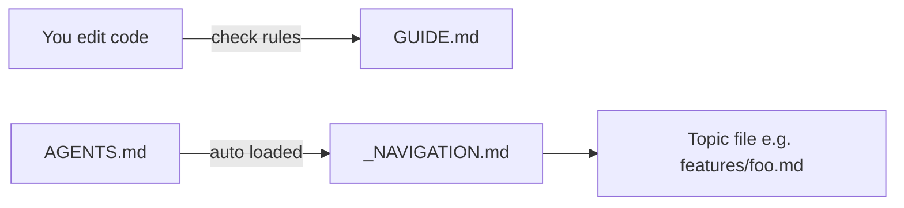

# Agent context — guide for you

**This file is for you, not for agents.** Agents should not read it unless you attach it on purpose.

Bookmark this page when you change code and need to know what rules to follow and what context files to update.

---

## Part 1 — I changed code. What do I update?

| You edited… | Update these context files | Code rules to follow |
|-------------|---------------------------|----------------------|
| `back/Features/{Name}/` (new or changed feature) | `features/{name}.md`, one row in `_NAVIGATION.md` and `_INDEX.md` | Copy the `WeatherForecast` folder pattern. Register `Add{Name}Feature()` in `Program.cs`. |
| `back/Infrastructure/` | `back/infrastructure.md` only | Use extension methods on `IServiceCollection` / `WebApplication`. No feature logic here. |
| `back/Program.cs` | `back/architecture.md` (only if startup order changes) | Chain `.AddInfrastructure().Add{Feature}()`. Do not register services inline. |
| `client/src/` or `client/vite.config.ts` | `client/architecture.md` when you add routing, API client, or new patterns | Use `/api` prefix for API calls. Vite proxy points to backend HTTPS port. |
| `devops/` (Docker, Postgres, env) | `devops/local-setup.md` | Never commit `.env`. Document ports and env var names — not real passwords. |
| Project-wide naming, DI, or git habits | `conventions.md` | One place for rules that apply everywhere. |
| Ports, folders, or run commands | `monorepo.md` | Facts only — no long explanations. |
| Agent context system itself | `meta.md`, plus `_NAVIGATION.md` + `_INDEX.md` | Lean format, one fact per file. Update `AGENTS.md` only for new routes. |

**Rule:** one fact lives in one file. Update the matching file. Do not copy the same text into `AGENTS.md` or this `GUIDE.md`.

---

## Part 2 — How does this system work?

There are three layers. Each has a different job.

### Layer 1 — `AGENTS.md` (repo root)

- Cursor loads this automatically in every agent session.
- Keep it short (~40 lines). It only routes the agent to the right context file.
- Do not put architecture details here.

### Layer 2 — `agent-context/` (this folder)

- Modular files with facts about the codebase.
- Agents read them on demand — you `@` mention them or upload them.
- Files are short and token-friendly. No long tutorials.

**Important files:**

| File | Job |
|------|-----|
| `_NAVIGATION.md` | "If you need X, read Y" — fastest way to find the right file |
| `_INDEX.md` | Full list of all context files |
| `_TEMPLATE.md` | Copy when you add a new context file |
| `conventions.md` | Naming, DI, API patterns |
| `monorepo.md` | Folders, ports, run commands |
| `back/`, `client/`, `devops/` | Area-specific context |
| `features/` | One file per API feature |

### Layer 3 — `.cursor/rules/agent-behavior.mdc`

- Tiny rules that apply automatically (commit policy, minimal scope).
- Do not put architecture here — only behavior.

---

## Part 3 — Checklist before you finish a task

- [ ] Code matches the pattern in `conventions.md` or the relevant `features/*.md`
- [ ] If you added a new feature folder, `features/{name}.md` exists
- [ ] `_NAVIGATION.md` and `_INDEX.md` have new rows (if you added a feature or new context file)
- [ ] You did **not** paste the same info into `AGENTS.md` or `GUIDE.md`
- [ ] No secrets in context files (use references to `appsettings.Development.json` or `.env.example`)

---

## Part 4 — How to add a new backend feature

Agent topic files use lean format: no YAML frontmatter (navigation lives in `_NAVIGATION.md` only), optional one-line subtitle under the title, then `Key files` / `Patterns` / `Do / Don't`.

1. Create code in `back/Features/{Name}/` (copy `WeatherForecast` structure).
2. Add `Add{Name}Feature()` to `Program.cs`.
3. Copy `features/_TEMPLATE.md` → `features/{name}.md` and fill it in.
4. Add one row to `_NAVIGATION.md` and `_INDEX.md`.

---

## Part 5 — Quick links

| Open this when… | File |
|-----------------|------|
| You forget what to update after editing code | `GUIDE.md` (this file) |
| You start a new agent and want to point it to the right file | `_NAVIGATION.md` |
| You need a full list of context files | `_INDEX.md` |
| You add a new context file | `_TEMPLATE.md` |
| Naming, DI, API routes | `conventions.md` |
| Ports, folders, how to run | `monorepo.md` |
| Backend structure, Program.cs | `back/architecture.md` |
| Database, middleware | `back/infrastructure.md` |
| Frontend, Vite proxy | `client/architecture.md` |
| Docker, Postgres | `devops/local-setup.md` |
| Reference feature example | `features/weather-forecast.md` |
| New feature template | `features/_TEMPLATE.md` |
| Change or extend the context system (attach for agents) | `meta.md` |
| Agent entry point (auto-loaded) | `../AGENTS.md` |

---

## Part 6 — How to use this with a new agent

1. Start a new agent session — it will read `AGENTS.md` automatically.
2. For a specific task, `@` mention one file from `_NAVIGATION.md` (e.g. `@agent-context/features/weather-forecast.md`).
3. Do **not** attach all files — that wastes tokens.
4. Attach `meta.md` when you want an agent to change or extend this context system. Attach `GUIDE.md` only for human-oriented explanations.
